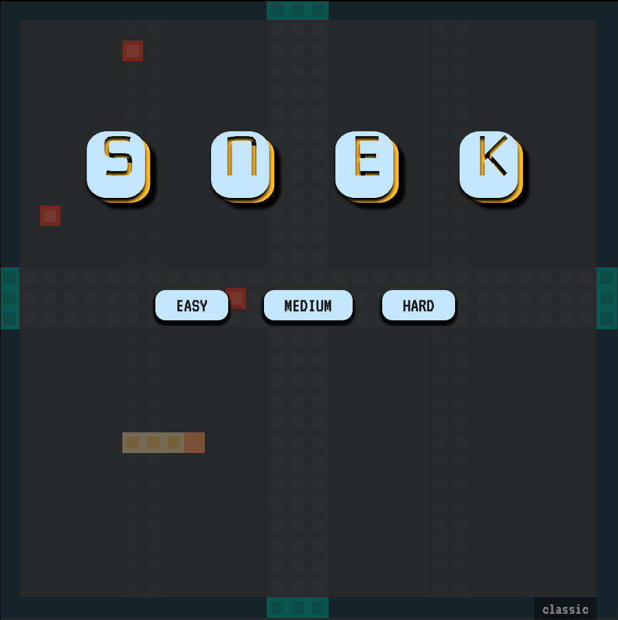

# Snek Game

A gamedev rite of passage to be sure. Made with [P5.js](https://p5js.org/).

## Demo

You can [play the demo here](https://townofdon.github.io/snek-js/)!

<p align="center">
    <a href="https://townofdon.github.io/snek-js/" target="_blank" ref="noopener noreferrer"></a>
    <a href="https://townofdon.github.io/snek-js/" target="_blank" ref="noopener noreferrer"></a>
    <a href="https://townofdon.github.io/snek-js/" target="_blank" ref="noopener noreferrer"></a>
    <a href="https://townofdon.github.io/snek-js/" target="_blank" ref="noopener noreferrer"></a>
</p>

## Development

Start dev server:

```
npm start
```

In a separate tap, watch for JS file changes:

```
npm run watch
```

## Deployment - GH

```
git subtree push --prefix dist origin gh-pages
```

If you need to force push subtree changes, [see here](https://gist.github.com/tduarte/eac064b4778711b116bb827f8c9bef7b).


## Convert WAV to MP3

bitrate=[128k|256k]

```
brew install ffmpeg
```

```
cd /path/to/dir
BITRATE=128k
for i in *.wav; do ffmpeg -i "$i" -acodec mp3 -b:a $BITRATE "mp3/${i%.*}.mp3"; done
```

Sources:

- https://www.christopherlovell.co.uk/blog/2016/08/16/convert-wav-mp3.html
- https://trac.ffmpeg.org/wiki/Encode/MP3
- https://stackoverflow.com/a/33766147
